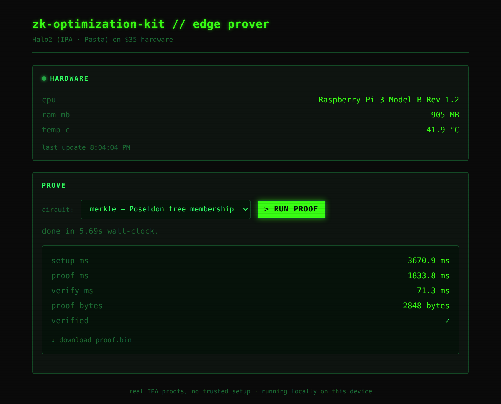

# zk-optimization-kit

**Zcash's real proving stack (Halo2) running on a $35 Raspberry Pi.**

A zero-knowledge proving toolkit that runs [`zcash/halo2`](https://github.com/zcash/halo2),
the actual Halo2 IPA stack over the Pasta curves with **no trusted setup**, on constrained
edge hardware, and benchmarks how well it performs there.

The contribution is **evidence**: Zcash's production proving stack runs on a $35 board, a
systems-and-measurement result for hardware nobody benchmarks it on. The thesis: private
proofs should be feasible on cheap, low-power devices. That matters for Zcash wallet/mobile
proving and for decentralizing who can produce proofs. This kit measures whether, and how
well, real Halo2 proving runs on a $35 ARM SBC using Zcash's own gadget library, across
three circuits including a **Poseidon Merkle-path membership proof** that mirrors the shape
of a Zcash note-commitment-tree inclusion. Scope note: the circuits are deliberately small
and well-known; the work is the engineering and the measurement, not a new proof system.



*The dashboard above is served directly from the Pi. `cpu`, `ram`, and `temp` are read
live off the board, and the result shown is a real Poseidon Merkle-membership proof
produced on the device (prove 1.83 s, verify 71 ms, verified ✓).*

---

## Results: Raspberry Pi 3B vs. laptop

Every number below comes from actually running the IPA prove → verify pipeline
(`zk-core bench`). Nothing is fabricated; the raw JSON for both machines is committed under
[`bench-results/`](bench-results/).

Three circuits, two domain sizes each:

- **cubic** — `x³ + x + 5 = y` (the classic toy circuit), at `k = 4` and `k = 8`
- **poseidon** — a Poseidon preimage `Poseidon(preimage) = hash` built with
  [`halo2_gadgets`](https://github.com/zcash/halo2) (Zcash's gadget library, `P128Pow5T3`,
  the Orchard hash), at `k = 6` and `k = 7`
- **merkle** — a **Poseidon Merkle-path membership proof** (depth 8): prove a leaf is in a
  tree given its root, doing one in-circuit Poseidon hash per level with a conditional swap.
  This is the same *shape* as a Zcash note-commitment-tree inclusion (Orchard's tree is
  depth 32), scaled down. Heaviest workload here, at `k = 9` and `k = 10`.

**Prove time (ms), lower is better:**

| circuit  | k | Raspberry Pi 3B | Laptop (i7-1185G7) | Pi / laptop |
|----------|---|-----------------|--------------------|-------------|
| cubic    | 4 | 271.7           | 15.7               | ~17×        |
| cubic    | 8 | 705.1           | 45.0               | ~16×        |
| poseidon | 6 | 479.0           | 34.2               | ~14×        |
| poseidon | 7 | 626.4           | 41.9               | ~15×        |
| merkle   | 9 | 1857.4          | 122.1              | ~15×        |
| merkle   | 10| 2874.1          | 175.5              | ~16×        |

**Full Raspberry Pi 3B sweep** (`Raspberry Pi 3 Model B Rev 1.2`, 905 MB RAM, 39.2 °C).
Energy is **modeled at 3 W** (see below), not metered:

| circuit  | k | setup ms | proof ms | verify ms | proof bytes | peak RSS KiB | energy J | verified |
|----------|---|----------|----------|-----------|-------------|--------------|----------|----------|
| cubic    | 4 | 88.6     | 271.7    | 28.2      | 1216        | 4892         | 0.82     | ✅       |
| cubic    | 8 | 1311.6   | 705.1    | 43.3      | 1472        | 5676         | 2.12     | ✅       |
| poseidon | 6 | 480.5    | 479.0    | 34.3      | 2080        | 6044         | 1.44     | ✅       |
| poseidon | 7 | 893.1    | 626.4    | 39.9      | 2144        | 6952         | 1.88     | ✅       |
| merkle   | 9 | 3629.7   | 1857.4   | 70.5      | 2848        | 15904        | 5.57     | ✅       |
| merkle   | 10| 6771.2   | 2874.1   | 105.0     | 2912        | 26612        | 8.62     | ✅       |

**Takeaways:**

- A full Halo2 IPA proof of the Poseidon circuit completes in **well under a second**
  on a Raspberry Pi 3B (479 ms at k=6, 626 ms at k=7), and verifies in **under ~40 ms**.
- The Zcash-relevant **Merkle-membership** proof (one Poseidon per tree level) still runs
  fully on-device: **~2.9 s** to prove at k=10, verify in **~105 ms**, peak RAM **~26 MiB**.
- The Pi is only **~14–17× slower** than an 11th-gen laptop across every circuit, despite
  being roughly two orders of magnitude cheaper.
- For the small circuits, peak resident memory stays under **~7 MiB**; even the heaviest
  point (merkle k=10) needs only **~26 MiB**, comfortably within reach of small devices.

> **Memory measurement (now per-row isolated):** `peak_rss_kb` is read from
> `/proc/self/status` `VmHWM`, a *process-wide* high-water mark. To make each row a genuine
> per-run figure rather than a monotonic high-water mark, `bench` runs **every (circuit, k)
> point in its own subprocess** (re-invoking the binary's internal `bench-one` subcommand)
> and reads that fresh process's `VmHWM`. Each row therefore reflects the isolated peak of
> exactly one proving run.

### Energy (modeled, not metered)

A Raspberry Pi 3B has no on-board power sensor, and the Cortex-A53 exposes no RAPL counters,
so energy here is **modeled, not measured**: `energy_J = assumed_power_W × proof_ms / 1000`.
The wall-clock `proof_ms` is real; the power figure is an assumption, a conservative **3 W**
under full CPU load by default. Nothing here is a fabricated joule reading.

To report a true figure, measure board power with an inline USB meter while proving and set
`ZK_BENCH_POWER_W` to your measured wattage; every energy column rescales accordingly.

### Scaling: where's the wall?

Pushing the cubic circuit to larger `k` on the Pi (each point its own isolated run) shows the
binding constraint is **wall-clock time, not memory**:

| k  | setup s | proof s | peak RSS | notes                          |
|----|---------|---------|----------|--------------------------------|
| 8  | 1.3     | 0.7     | ~6 MiB   | sub-second proof               |
| 12 | 26.7    | 5.6     | ~17 MiB  |                                |
| 14 | 116.9   | 20.1    | ~50 MiB  | a single proof now takes ~2 min |
| 16 | 528.2   | 75.3    | ~183 MiB | ~10 min for one proof          |

Each `+2` in `k` (≈4× the rows) costs **roughly 4–5× the time** while memory grows much more
slowly. On a 905 MB board the practical wall is reached long before RAM runs out: by k=16 a
single proof already takes **~10 minutes**, even though peak RSS is still only ~183 MiB. The
$35 Pi's limit for these circuits is patience, not memory.

---

## What's in the box

```
zk-core/                  Rust workspace member: the prover + dashboard
  src/circuit/cubic.rs    circuit: x^3 + x + 5 = y   (x private, y public)
  src/circuit/poseidon.rs circuit: Poseidon(preimage) = hash  (halo2_gadgets)
  src/circuit/merkle.rs   circuit: Poseidon Merkle-path membership (depth 8)
  src/prover.rs           IPA setup -> prove -> verify, with timings
  src/bench.rs            per-row isolated sweep (subprocess) + modeled energy
  src/hwinfo.rs           read CPU / RAM / temperature from /proc, /sys
  src/server.rs           axum dashboard + JSON API
  src/main.rs             CLI: prove / bench / bench-one / serve / verify
  static/index.html       terminal-style dashboard (green-on-black)
verifier/                 standalone proof verifier (no prover needed)
scripts/                  cross-build.sh + deploy.sh (aarch64 -> Pi)
bench-results/            committed JSON: results-pi.json, results-laptop.json
```

The commitment scheme is the **Inner Product Argument (IPA)** over the Pasta curves,
Zcash's real, **trusted-setup-free** stack. There is exactly **one** verification code path
(`zk_core::prover::verify_file`); both the CLI `verify` subcommand and the standalone
`verifier` crate call it, so a skeptic verifies the same way the prover does.

---

## Quick start

Requires a stable Rust toolchain (`rustup`).

```bash
# Run a real proof of the cubic circuit; writes ./proof.bin, prints JSON
cargo run --release -p zk-core -- prove --circuit cubic

# Run the full benchmark sweep; writes bench-results/results.json, prints a table
cargo run --release -p zk-core -- bench

# Launch the live dashboard at http://localhost:8080
cargo run --release -p zk-core -- serve --port 8080
```

### Independent verification

Anyone can verify a proof artifact **without trusting the prover**:

```bash
# Produce a proof, then verify it with the standalone verifier
cargo run --release -p zk-core   -- prove  --circuit cubic
cargo run --release -p verifier  --        --circuit cubic --proof proof.bin --public 35
# -> Verified: true   (exit 0)

# Tamper with the public input and it correctly fails:
cargo run --release -p verifier  --        --circuit cubic --proof proof.bin --public 36
# -> Verified: false  (exit 1)
```

A committed sample proof lives at [`bench-results/sample-proof.bin`](bench-results/sample-proof.bin).

---

## Reproducing the edge results

The Pi numbers above were produced by cross-compiling for `aarch64` and running on a real
Raspberry Pi 3B:

```bash
# Cross-compile zk-core + verifier for aarch64 (uses `cross` if installed)
./scripts/cross-build.sh

# Copy binaries + dashboard to the Pi and print the run command
./scripts/deploy.sh user@your-pi-host

# On the Pi:
cd ~/zk-optimization-kit
./zk-core bench            # reproduces bench-results/results-pi.json
./zk-core serve --port 8080
```

---

## Roadmap

- On-MCU proving experiments (RP2350 / ESP32-class): how small can the device get?
- **Metered** energy: replace the 3 W model with inline-USB-meter readings via `ZK_BENCH_POWER_W`.
- A full-depth (32-level) Orchard-style commitment-tree path, and a slice of the Orchard
  action circuit, as the next Zcash-relevant workloads.
- GPU/NEON-accelerated MSM to push the time wall (currently the binding constraint) further out.

**Done since first release:** modeled energy per proof · push-to-the-wall `k` sweep ·
Poseidon Merkle-membership circuit · per-row isolated memory measurement.

## Scope

This is a **systems and measurement** project. The value is hard evidence that Zcash's real
Halo2 stack runs on cheap, low-power hardware, plus a reproducible harness for anyone who
wants to extend the measurements. The circuits are deliberately small and well-known: the
contribution is the engineering and the numbers, not a new proof system.

## License

MIT. See [LICENSE](LICENSE).
